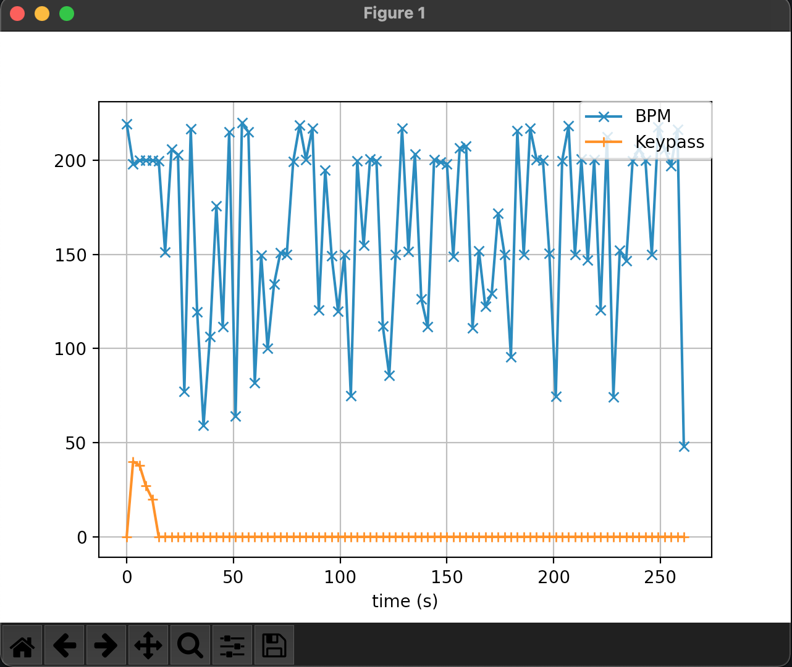

# BPMD

## Environment

- Python 3.9
- MacOS Big Sur 11.4
- ffmpeg 4.4
- fluidsynth 2.2.2

## First project: BPM Detention

1. Add a song to the project folder, name it to 'song'.

2. Execute some commands:

```
$ cd bpmd
$ python -m venv venv
$ source venv/bin/activate
$ pip install -r requirements.txt
$ sudo python main.py
```

3. Click on "ESC" to end the process and get the chart like this.



## Second project: Write A Song

1. Add a csv file to the project folder, name it to 'data.csv', it should adhere to the following
   format:

```
Date,Starting Time,Duration
2021.4.4,17:08,68
2021.4.5,17:40,93
2021.4.6,14:41,133
```

2. Download sound style file to the project folder, click this [URL](https://github.com/musescore/MuseScore/blob/master/share/sound/FluidR3Mono_GM.sf3).

3. Execute some commands:

```
$ cd bpmd
$ python make_song.py
```

4. Get a new song, play it and have fun!
